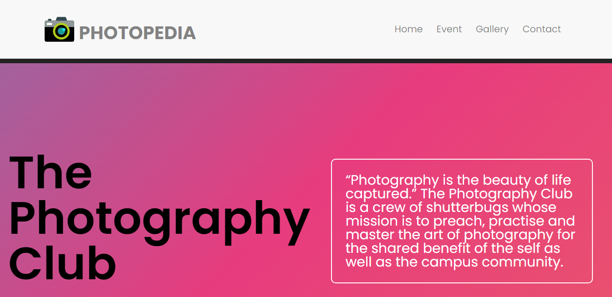
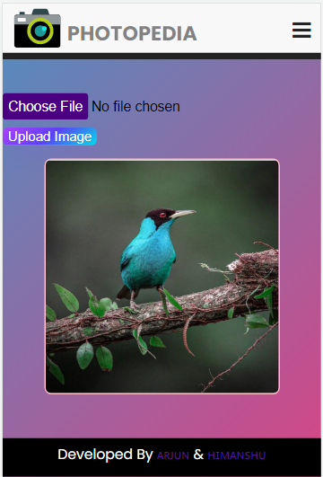

<p align="center">
<h1 align="center">
	<a href="https://youtemy.tech"></a>
</h1>

<a href="https://github.com/arjunsharma1152/club-web/graphs/contributors">
        	
	</a>
	</p>
# Tech Stack

Photopedia is a web app built with the following:

- [Javascript](https://www.javascript.com)
- [ReactJS](https://reactjs.org/)
- [Firebase](https://firebase.google.com)

> # 📷 Snapshots of the Hosted Projects

> ### 

> ### 

> ### 

> ### 

## Starting the Dev Server

- Clone the repository to your local system. `https://github.com/arjunsharma1152/club-web`

- Firebase API Setup:

  1.  Go to [Firebase Console](https://console.firebase.google.com) and follow the steps to create a new Firebase project.
  2.  Select `</>` and you will recieve a firebasConfig object with the first paramter as API key. Copy it, which will look something like: 
  	
	```js
              cosnt firebaseConfig = {
              apiKey: "process.env.REACT_APP_FIREBASE",
              authDomain: "AUTH_DOMAIN",
              projectId: "PROJECT_ID",
              storageBucket: "STORAGE_BUCKET",
              messagingSenderId: "*************",
              appId: "******************************",
              measurementId: "*************"
            };
      ```
   3.  Paste and save it. 
   
- In the root folder and enter the following commands in the CLI

          npm i or yarn
          npm start or yarn start
